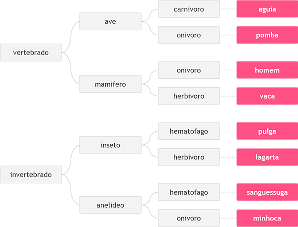

# Desafio
Neste problema, você deverá ler 3 palavras que definem o tipo de animal possível segundo o esquema abaixo, da esquerda para a direita.  Em seguida conclua qual dos animais seguintes foi escolhido, através das três palavras fornecidas.

# Entrada
Imprima o nome do animal correspondente à entrada fornecida.

# Saída
Imprima o nome do animal correspondente à entrada fornecida.
| Exemplo de Entrada| Exemplo de Saída  |
| -------------     | -------------     |
| vertebrado        | Homem             |
| mamifero          |                   |
| onivoro           |                   |

